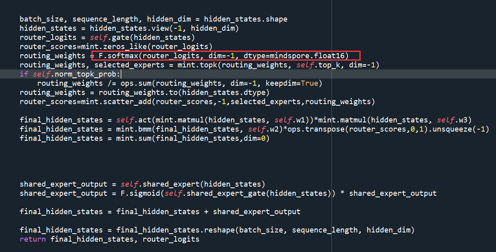
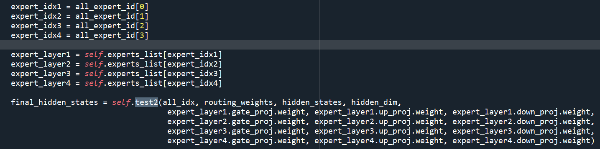
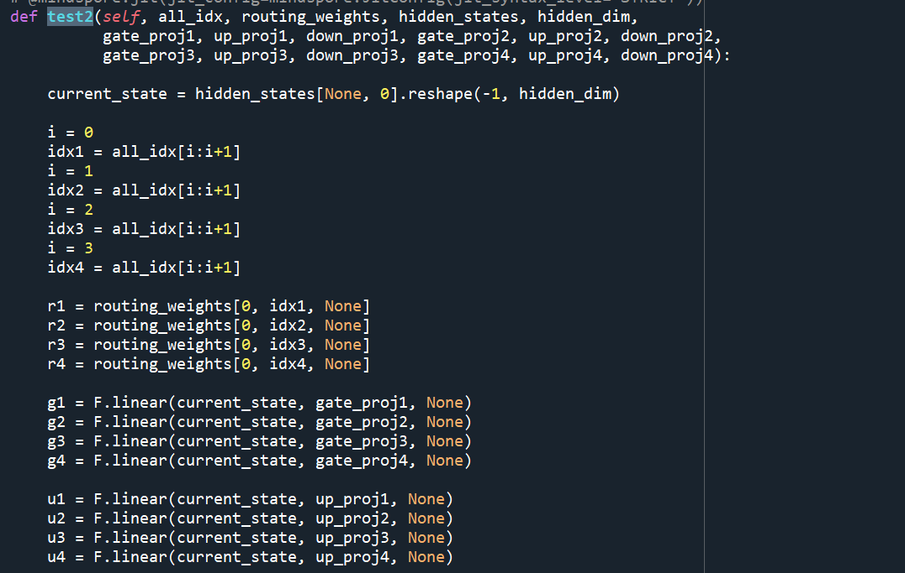
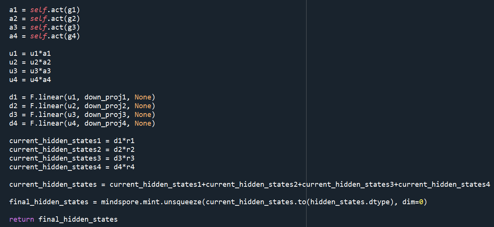

# 最终优化结果：
| 评测指标 | 平均得分 |
|---------|---------|
| 峰值显存得分 | 64.795 |
| Prefill时延得分 | 2874.9904    |
| Decode时延得分 | 732.4407     |
| **总分** | **1224.0754** |

判题机器执行结果如下：
Qwen1.5-MoE-A2.7B-Chat:
"avg_prefill_latency": 0.07618347803751628, "avg_decode_latency": 0.0671661638419687
deepseek-moe-16b-chat:
"avg_prefill_latency": 0.11087759335835774, "avg_decode_latency": 0.10076366447971156

本次moe赛题，总结来说我一共尝试过三种主要的方案：
先说明下有一些零碎的优化点，但是基本看不出效果，比如接入rms_norm大算子，这个操作其实理论上是有提升的，rms_norm大算子的推理速度是用其它小算子拼接出来的实现快3倍左右，但由于rms_norm操作本身占用时间就非常少，大算子为0.6毫秒，小算子拼接方案大致2毫秒左右，所以在整个推理时间中的影响非常小，且上述时间是在动态图同步模式下测得的单算子执行时间，而实际运行的是动态图的异步模式，由于异步下发的原因，几乎就把这点微弱的提升给抹平了，所以基本看不出提升；

# 1.最终提交的方案：

把每一层的moe 每个专家的权重事先都合并起来，然后推理的时候就执行一次；从而避开了每个专家需要单独执行，以及筛选出需要执行的专家的逻辑，动态图执行的大部分耗时都在python时间上（一些python逻辑，调用相关python api触发算子下发等操作），即cpu耗时，在鲲鹏环境中，这个特性尤其明显，哪怕绑核后，相比x86环境这个耗时也更加巨大；而该方案，避开了筛选专家的逻辑，即避开了很多相关api的调用，节省了大量的python时间，以及所有专家都合并起来了，也就是不需要循环调用每个专家，python api的调用次数也大大减少，尤其prefill阶段，自然也节省了大量的python时间；还有，原本的实现中，挑选moe的逻辑用到了nonzero等比较耗时的算子，该方案由于没有挑选逻辑，所以也避开了nonzero这样非常耗时的算子；
当然此方案的缺点在于，由于实现把权重融合，导致显存占用大大提升（这边其实我也不太理解，照理说我合并后权重大小并没有变化，且我也把原来的分开的权重给删除了，也调用了mindspore各种释放缓存的api，所以应该是显存占用不变的，但结果却大大增加，目前我也还没搞明白这边动态图的显存分配机制）；还有一点，就是在prefill阶段，可以认为所有专家都参与了计算，我这边合起来之后，也没有增加额外多余的计算；但decode阶段，其实只有部分专家（qwen是4个，ds是6个）参与计算，合起来之后就等于是其它所有专家也都参与了计算，就大大增加了计算量；当然在本次任务中，decode阶段增加计算量产生的耗时，远远比不上合并方案减少的python时间，所以最终收益依旧明显，只是decode的提升没有prefill阶段那么大；

此方案实现过程中的问题主要是精度对齐问题，虽然完全数学等价，但由于框架api、算子计算顺序和逻辑的改变，导致精度会产生变化，比如qwen moe模型，我必须在计算时把softmax操作转成fp16才行，然后下面在转回题目要求使用的bf16，否则精度无法全对齐（测试下来不这样转一下，只有一条数据match）：

</img>

# 2.尝试过的优化decode阶段的moe调用逻辑方案：

在for 循环之外，对所有expert_mask调用一次nonzero算子，一次性获取所有筛选的专家id:
all_expert_id, all_idx, all_top_x = ops.nonzero(expert_mask, as_tuple=True)
这样避免了每次循环都调用节省时间，然后后面由于decode阶段专家数量少且固定，根据专家id手动获取每个专家并调用，写死在代码里，如下：

</img>
</img>
</img>

这个方案在decode阶段收益也是比较明显的，但比我提交的最终方案要差一些

# 3.整图静态图方案的尝试：

把整个模型打上jit，这个如果能实现，其实效果是最好的，我尝试下来在我上述方案的基础上加上整图静态化，decode时间还能比我的最终方案明显提升，但精度却不能完全对齐；
这个方案理论上是完全数学等价的，但可能静态图和动态图机制、cann层算子调用、以及执行顺序的差异，导致精度有一些误差，3条测试数据一开始只有一条match，后来改了些数据类型，另外两条match了，但原来match的却变成dismatch，这个精度对齐相当困难，我最终也没能完全对齐，所以没能提交该方案

如果不考虑精度，使用此方案有几点需要注意；首先默认的动态图实现使用kvcache类是动态cache，需要改成静态Cache类，且由于静态图的特性，输入shape不同，就会触发重编译，所以prefill阶段需要特殊处理，否则特别慢；特殊处理的方法包括：用特定数据填充输入长度、或者使能mindspore图模式的动态输入机制（即nn.Cell的set_inputs方法，不过这个方案我试过会损耗静态图的性能）、或者prefill阶段就走动态图，只有decode阶段走静态图
